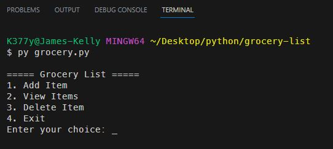
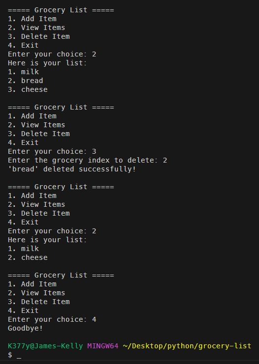

# Grocery List

## *Description*
This is a simple list creator app.  It can add (append), remove (pop), and view items (groceries in this example) from an array.  The list is not stored in a database, so it will be lost when the program is closed.
 

## *Installation*
To install this app, simply clone the repository and run the `grocery.py` file in your terminal.
 

## *Usage*
When prompted: 
Choose one of the 4 options.
 
Then follow the prompts to add, remove, or view items.
 

 
 

 

## *Questions*
<h3>Portfolio:&emsp;<a href="https://jk377y.dev" target="_blank">https://jk377y.dev</a></h3>
<h3>Email:&emsp;<a href="mailto:jk377y@gmail.com" target="_blank">jk377y@gmail.com</a></h3>
<h3>LinkedIn:&emsp;<a href="https://www.linkedin.com/in/james-kelly-software-developer/" target="_blank">https://www.linkedin.com/in/james-kelly-software-developer/</a></h3>
<h3>GitHub:&emsp;<a href="https://github.com/jk377y" target="_blank">https://github.com/jk377y</a></h3>
 

## *License*

 Copyright (c) 2023 James Kelly
 Information on this license can be found at: (https://opensource.org/licenses/MIT)